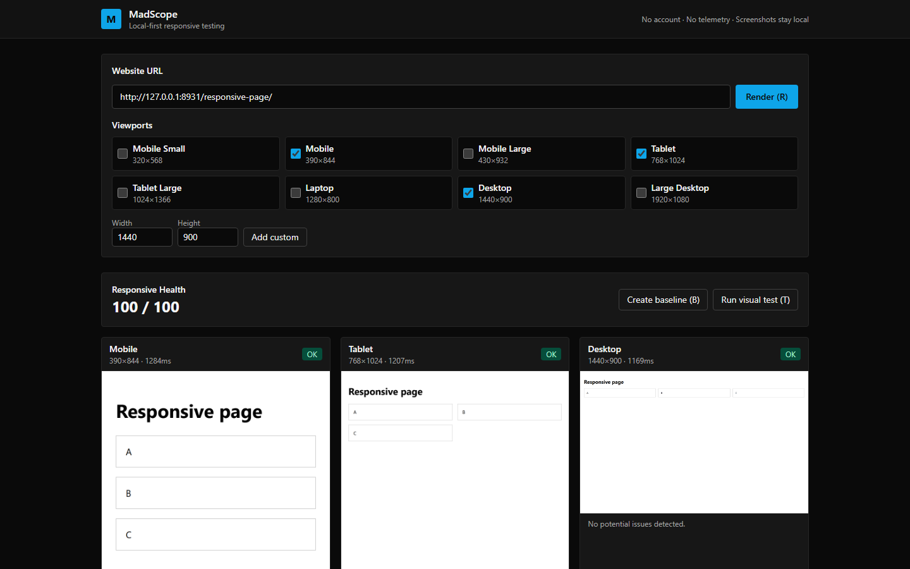
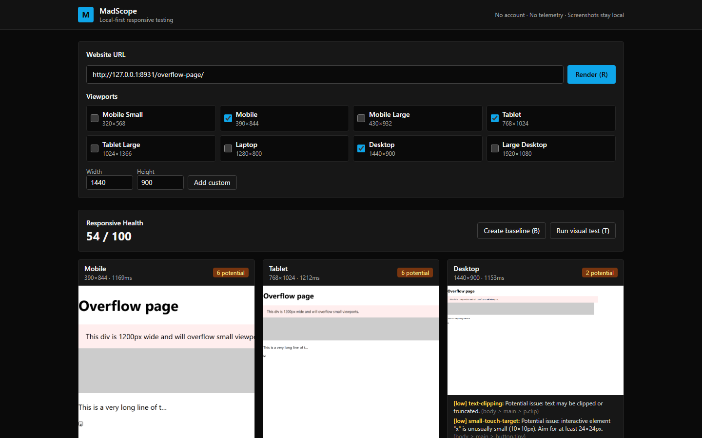
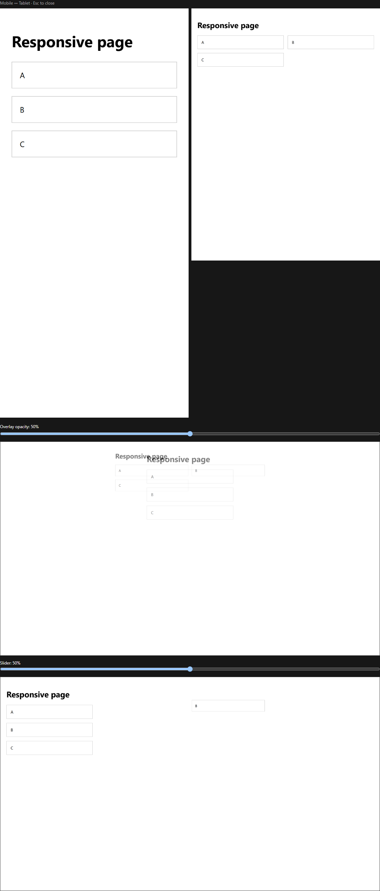
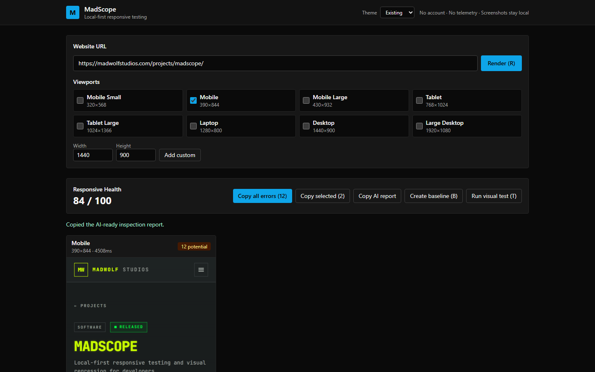
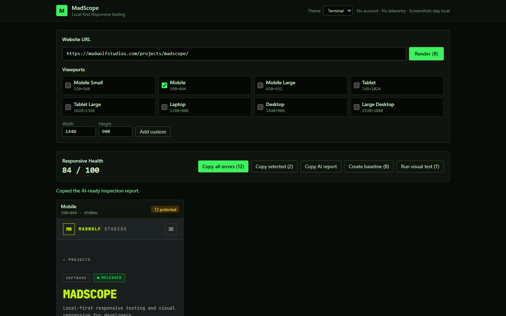
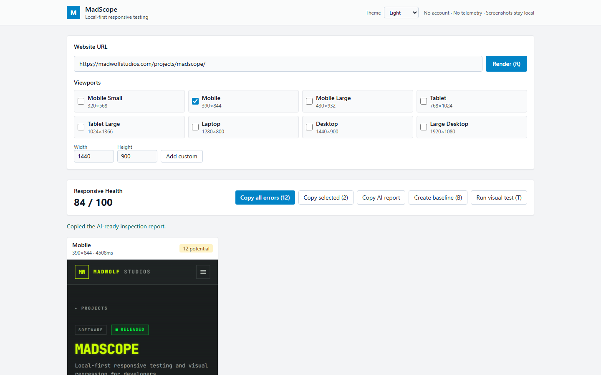
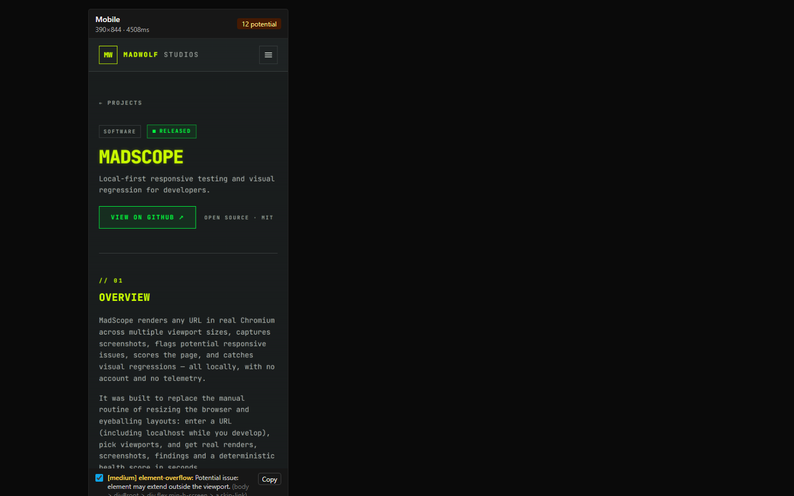
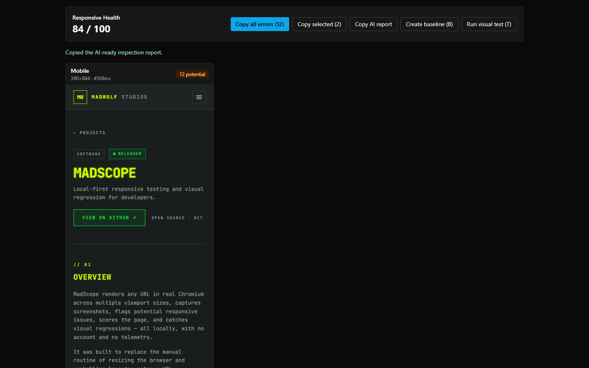

# MadScope

> **Local-first responsive website testing and visual regression for developers.**

MadScope renders any URL in real Chromium across multiple viewport sizes, captures screenshots, flags potential responsive issues, scores the page, and catches visual regressions — all on your machine, with no account and no telemetry.



**Status:** v1.0.1 — desktop app (Windows/macOS/Linux installers via GitHub Releases), CLI, visual regression, automated tests.
**License:** MIT — free and open source.

## Download MadScope

Latest release: [v1.0.1](https://github.com/MadalinWolf/MadScope/releases/tag/v1.0.1) · [all downloads](https://github.com/MadalinWolf/MadScope/releases)

| Platform                    | Download                                                                                                                                      |
| --------------------------- | --------------------------------------------------------------------------------------------------------------------------------------------- |
| Windows x64 (MSI installer) | [MadScope-1.0.1-windows-x64.msi](https://github.com/MadalinWolf/MadScope/releases/download/v1.0.1/MadScope-1.0.1-windows-x64.msi)             |
| Windows x64 (setup wizard)  | [MadScope-1.0.1-windows-x64-setup.exe](https://github.com/MadalinWolf/MadScope/releases/download/v1.0.1/MadScope-1.0.1-windows-x64-setup.exe) |
| macOS Apple Silicon         | [MadScope-1.0.1-macos-arm64.dmg](https://github.com/MadalinWolf/MadScope/releases/download/v1.0.1/MadScope-1.0.1-macos-arm64.dmg)             |
| macOS Intel                 | [MadScope-1.0.1-macos-x64.dmg](https://github.com/MadalinWolf/MadScope/releases/download/v1.0.1/MadScope-1.0.1-macos-x64.dmg)                 |
| Linux x64 (portable)        | [MadScope-1.0.1-linux-x64.AppImage](https://github.com/MadalinWolf/MadScope/releases/download/v1.0.1/MadScope-1.0.1-linux-x64.AppImage)       |
| Linux x64 (Debian/Ubuntu)   | [MadScope-1.0.1-linux-x64.deb](https://github.com/MadalinWolf/MadScope/releases/download/v1.0.1/MadScope-1.0.1-linux-x64.deb)                 |

> macOS builds are unsigned: on first launch, right-click → **Open** → **Open**. Verify downloads against `CHECKSUMS.txt` on the release page.

---

## Overview

MadScope is for frontend developers who ship responsive websites and are tired of resizing the browser by hand.

Enter a URL — including `http://localhost:3000` while you develop — pick viewports, and MadScope renders each one in real Chromium, captures screenshots, analyzes the layout, and tells you what looks wrong. Save a baseline today; run the same test tomorrow or in CI and get a deterministic pass/fail with a pixel-level diff.

What makes it different:

- **Local-first.** No account, no cloud, no telemetry. The render server binds to `127.0.0.1`; screenshots stay in `.madscope/` on your disk.
- **Real rendering.** Playwright + Chromium, per-viewport browser contexts (correct viewport, `isMobile`, touch, color scheme) — never static placeholders.
- **Honest findings.** Every detection is labeled a _potential_ issue, and the 0–100 health score is a documented, deterministic formula — not a black box.
- **One engine, three surfaces.** The same `@madscope/core` powers the desktop UI, the `madscope` CLI, and CI.

## Why MadScope

Manually testing a site at a few screen sizes misses things: a `1200px` div that overflows on phones, an image wider than its container, clipped ellipsis text, a `10×10px` button nobody can tap, elements overlapping only at tablet widths, a redesign that silently shifts the desktop layout. These are the bugs users find.

MadScope makes the check systematic: render every viewport, screenshot everything, analyze every layout, diff against the baseline — in seconds, repeatably.

## Features

### Responsive website testing

- 8 viewport presets (Mobile Small 320×568 → Large Desktop 1920×1080) plus custom dimensions
- Mobile / tablet / desktop contexts with correct device scale factor, `isMobile`, touch support
- Localhost URLs fully supported (`http://localhost:*`, `http://127.0.0.1:*`)
- Real Chromium rendering via Playwright; sequential rendering for stability, architecture ready for parallel

### Issue detection

Seven detectors, every finding worded as a _potential_ issue with type, severity, message, selector, viewport and evidence:

- horizontal overflow · element overflow · text clipping · image overflow · small touch targets · overlapping elements · off-screen elements



### Sharing diagnostics with an AI agent

Diagnostic text in the results is plain, selectable content — never `user-select: none`, never tooltip-only — and each viewport card lists **all** of its findings (no truncation). Copy controls:

- **Copy** (on each finding) — copies that one diagnostic with its type, severity, message, viewport, selector and evidence.
- **Copy all errors (N)** — prominent action in the results header; copies every diagnostic of the inspection, numbered in report order.
- **Copy selected (N)** — tick the checkbox next to the findings you care about and copy just those together.
- **Copy AI report** — copies the structured plain-text report for the whole inspection.

Every copy reports success only after the clipboard operation actually succeeded (async Clipboard API first, hidden-textarea `execCommand` fallback second) and shows the real failure message when it did not. Diagnostic messages and selectors wrap instead of overflowing, and keyboard users can reach every copy action with Tab.

The report uses only fields the engine actually knows:

```text
MADSCOPE WEBSITE INSPECTION REPORT

Inspected URL: https://madwolfstudios.com/projects/madscope/
Viewport: 390 × 844
Device/profile: mobile
Timestamp: 2026-10-09T14:03:11.284Z
Health score: 92 / 100
Diagnostics source: MadScope responsive issue detector (layout diagnostics)

SUMMARY
Total reported diagnostics: 3

ERRORS

[1] Type: horizontal-overflow
Severity: high
Message: Document scrolls horizontally: 412px content in 390px viewport.
Viewport: Mobile 390×844
Selector: .page
Evidence: scrollWidth=412 viewportWidth=390

[2] Type: small-touch-target
Severity: low
…

END OF REPORT
```

Paste it directly into OpenCode or another AI coding agent — for example: *"Fix the diagnostics in this MadScope report for my mobile viewport."* — and the agent gets the exact URL, viewport dimensions, per-finding severity/selector/evidence, and a summary count that matches the entries. The report is still useful at zero diagnostics ("Total reported diagnostics: 0").

**Scope and honesty:** MadScope's engine detects the seven responsive *layout* diagnostics above. It does not collect JavaScript exceptions, failed network requests or accessibility audits, so the report states `Diagnostics source: MadScope responsive issue detector (layout diagnostics)` instead of inventing categories, and it never emits a browser/runtime line it cannot know. Diagnostics of the inspected site are kept separate from MadScope's own engine errors (those appear as the red alert under the URL field and are not part of the report).

### Responsive Health score

A transparent 0–100 score: start at 100, subtract fixed per-type penalties (e.g. horizontal overflow −15, element overflow −4 each capped at −20). Same page, same score — every time. Formula: [`docs/scoring.md`](docs/scoring.md).

### Screenshot capture

- PNG and JPEG, viewport or full-page, animations disabled by default for stable captures
- Saved locally with metadata (URL, viewport, dimensions, timestamp) plus a searchable `history.json`

### Visual comparison

Side-by-side, overlay with opacity control, before/after slider, and a deterministic pixelmatch diff image.



### Visual regression

```bash
madscope baseline https://example.com
madscope test https://example.com
# ✓ Mobile 390×844 — No significant visual change (0.00% <= 0.50%)
# ✗ Desktop 1440×900 — Visual difference detected (2.84% > 0.50%)
```

Baselines live in `.madscope/baselines/`; test results (`actual-*`, `diff-*`) in `.madscope/results/`. `madscope test` exits `1` on failure or missing baseline — CI-ready. Threshold configurable per project.

### Breakpoint ruler

A ruler of common breakpoints (320 → 1920) under every scan, so you can see where layout behavior should change.

### CLI

```bash
madscope screenshot https://example.com --viewport mobile tablet desktop
madscope screenshot http://localhost:3000 --width 390 --height 844
madscope baseline https://example.com
madscope test https://example.com --threshold 0.01
madscope config --init
```

Options: `--viewport`, `--width`/`--height`, `--device mobile`, `--full-page`, `--output`, `--threshold`.

### Desktop application

React + Tailwind UI (also wrapped as a Tauri desktop app): URL bar with validation, viewport picker, theme selector, live results with health score, diagnostic copy controls, baseline/test actions, comparison views, keyboard shortcuts (`R` re-run, `S` screenshot, `B` baseline, `T` test, `Esc` close).

### Themes

A **Theme** selector in the header offers exactly three choices:

| Theme    | Look                                                                                                                             |
| -------- | -------------------------------------------------------------------------------------------------------------------------------- |
| Existing | The original MadScope dark design — the default, unchanged for existing users                                                    |
| Terminal | Near-black green-tinted charcoal, terminal-green accents, monospaced type for technical elements (URLs, dimensions, diagnostics, reports), clearly distinct success/warning/error colors |
| Light    | Bright white surfaces, dark readable text, subtle borders, restrained shadow on panels, accessible error/warning/success colors   |

Switching is instant (no reload) and persists in `localStorage` under `madscope-theme`, so it survives refreshes and later visits. Every color comes from CSS custom properties, so navigation, viewport cards, error lists, buttons, modals and reports all follow the selected theme; there is no hardcoded color that can ignore it.

### Local-first architecture

- No account · no telemetry code in the repo · no analytics · no cloud storage · no uploads
- Render server listens on `127.0.0.1` only; everything else is local file I/O

## How MadScope works

```text
URL
 ↓
Playwright / Chromium (@madscope/browser — one shared process, one context per viewport)
 ↓
Rendered page → screenshot (@madscope/screenshots — local files + metadata + history)
 ↓
In-page layout signals → issue detection (@madscope/issue-detector — 7 checks + health score)
 ↓
Screenshot vs baseline (@madscope/visual-diff — deterministic pixelmatch, change ratio)
 ↓
Regression result (pass / fail / no-baseline, exit code for CI)
```

`@madscope/core` orchestrates the pipeline with no UI dependencies, so the desktop UI (`apps/desktop`), the CLI (`apps/cli`) and future CI integrations all run the identical engine. Configuration is type-safe via `@madscope/config` (`madscope.config.ts`); shared types and viewport presets live in `@madscope/shared`. Details: [`docs/architecture.md`](docs/architecture.md).

## Privacy

MadScope is local-first by construction, not just by policy:

- The pages you test are fetched by _your_ local Chromium and rendered in memory on your machine.
- Screenshots and baselines are written to `.madscope/` in your working directory — nothing is uploaded anywhere (there is no upload code).
- The desktop render server binds to `127.0.0.1`, so it is unreachable from the network.
- There is no telemetry, analytics, account system, or API key in the codebase.

The only network traffic MadScope generates is the traffic your own browser would generate loading the URL you asked it to test, plus package-install downloads (npm, Playwright browsers).

## Installation

Requirements: **Node.js ≥ 18.18** and **npm**. For the Tauri native bundle: Rust stable + OS WebView dependencies.

```bash
git clone https://github.com/MadalinWolf/MadScope.git
cd MadScope
npm install
npx playwright install chromium
```

## Quick start

**Desktop UI:**

```bash
npm run dev:server   # render server on http://127.0.0.1:4220
npm run dev          # UI on http://localhost:1420
```

1. Enter a URL, e.g. `http://localhost:3000` or `https://example.com`.
2. Select viewports (Mobile, Tablet, Desktop) or add a custom size.
3. Press **Render** (or `R`) — each viewport renders for real, with screenshots and timings.
4. Review the Responsive Health score and the potential-issue list.
5. Press **Create baseline** (`B`), change your site, press **Run visual test** (`T`) — diffs and pass/fail appear inline.

**CLI:**

```bash
npm run build
node apps/cli/dist/index.js screenshot http://localhost:3000 --viewport mobile tablet desktop
node apps/cli/dist/index.js baseline http://localhost:3000
# ... change something ...
node apps/cli/dist/index.js test http://localhost:3000
```

## Configuration

Create `madscope.config.ts` in your project root (`madscope config --init` scaffolds one):

```ts
import { defineConfig } from "@madscope/config";

export default defineConfig({
  urls: ["https://example.com"],
  viewports: [
    {
      id: "mobile",
      name: "Mobile",
      width: 390,
      height: 844,
      isMobile: true,
      hasTouch: true,
    },
    {
      id: "tablet",
      name: "Tablet",
      width: 768,
      height: 1024,
      isMobile: true,
      hasTouch: true,
    },
    { id: "desktop", name: "Desktop", width: 1440, height: 900 },
  ],
  screenshot: {
    type: "png", // "png" | "jpeg"
    fullPage: false,
    animations: "disabled", // "disabled" | "allow"
    colorScheme: "no-preference", // "light" | "dark" | "no-preference"
    reducedMotion: "reduce",
    locale: "en-US",
  },
  diffThreshold: 0.005, // max fraction of changed pixels before failure
  waitTime: 500, // ms to settle after load before capture
  navigationTimeout: 30000,
  outDir: ".madscope/screenshots",
  baselineDir: ".madscope/baselines",
  resultsDir: ".madscope/results",
});
```

Invalid values throw human-readable errors. Full reference: [`docs/configuration.md`](docs/configuration.md).

## Screenshots

All screenshots below are real MadScope output (deterministic local fixtures, no mockups).

| Main interface — scan across viewports                        | Issue detection with health score                            |
| ------------------------------------------------------------- | ------------------------------------------------------------ |
|  |  |

| Visual comparison — overlay + slider                            |
| --------------------------------------------------------------- |
|  |

| Existing theme                                               | Terminal theme                                              | Light theme                                           |
| ------------------------------------------------------------ | ----------------------------------------------------------- | ----------------------------------------------------- |
|  |  |  |

| Mobile viewport inspection with real diagnostics                | Copy controls + AI-report feedback                             |
| --------------------------------------------------------------- | --------------------------------------------------------------- |
|  |  |

The theme and diagnostics screenshots are real captures of the running app inspecting this project's live MadScope page (`https://madwolfstudios.com/projects/madscope/`).

## Development

```bash
npm install
npm run dev:server       # render server on http://127.0.0.1:4220
npm run dev              # desktop UI on http://localhost:1420 (proxies /api)
npm run build            # build all packages + apps
npm test                 # full suite: unit + integration (needs Chromium)
npm run test:unit        # fast unit tests only
npm run test:integration # real browser tests (needs Chromium)
npm run lint             # eslint, zero warnings
npm run format           # prettier check
npm run typecheck        # tsc project references + apps
```

Unit tests cover the report formatter (field honesty, entry/summary counts, zero-diagnostic case), the theme set and persistence, and clipboard success/fallback/failure behavior; integration tests exercise the CLI and real Chromium rendering.

CI ([`.github/workflows/ci.yml`](.github/workflows/ci.yml)) runs `typecheck`, `lint`, the full test suite and a production build on every push; release installers are built from version tags ([`release.yml`](.github/workflows/release.yml)). Which checks ran, what passed, and what could not be tested for this release: [`docs/verification.md`](docs/verification.md).

### Desktop (Tauri)

The UI in `apps/desktop/src` runs in Vite during development. The Tauri shell in `apps/desktop/src-tauri` wraps the same `dist/` output:

```bash
cd apps/desktop
npx tauri dev     # needs Rust toolchain
npx tauri build   # needs Rust toolchain
```

Native installers are published via [GitHub Releases](https://github.com/MadalinWolf/MadScope/releases) (see Download below). The Tauri bundle embeds the full engine — portable Node, the render server and Chromium — so the app works offline after install with no extra setup. To build the installers yourself you need a Rust toolchain and platform WebView dependencies; `git tag v1.0.1 && git push origin v1.0.1` builds them on GitHub Actions (see [`.github/workflows/release.yml`](.github/workflows/release.yml)).

## Roadmap

Done in v1.1.0: three themes (Existing/Terminal/Light) with persistence, selectable diagnostics with copy-all/copy-selected and an AI-ready inspection report.

Done in v1.0.1: core engine, browser automation, screenshots + history, issue detection + score, comparison UI, baselines + regression, config, CLI, desktop installers, docs, tests.

Next: authenticated-session support (storage state/cookies with secret redaction), Firefox/WebKit engines, device presets, throttling, GitHub Marketplace listing for the action. See [`docs/roadmap.md`](docs/roadmap.md).

Experimental ideas (not implemented, architecture-ready): Lighthouse integration, accessibility checks, test recording, team/cloud features.

## Contributing

MadScope is MIT-licensed and open to contributions. Start with [`CONTRIBUTING.md`](CONTRIBUTING.md): keep the core UI-agnostic, never add fake functionality, never log secrets, add tests for new behavior.

Security issues: see [`SECURITY.md`](SECURITY.md) — please report privately, not via public issues.

## License

[MIT](LICENSE) — free for commercial and personal use.
